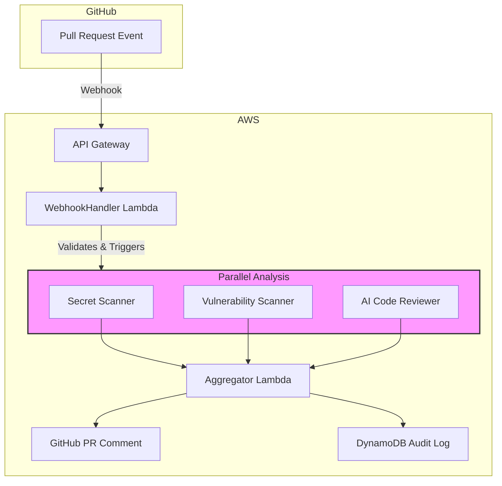

# DevSecOps Sentinel 🛡️

> **An AI-powered, serverless security and quality analysis platform for GitHub Pull Requests**

[](https://aws.amazon.com/serverless/sam/)
[](https://www.python.org/)
[](LICENSE)

## 🚀 What is DevSecOps Sentinel?

DevSecOps Sentinel is a **REAL, production-ready** serverless application that automatically analyzes GitHub pull requests for security vulnerabilities, code quality issues, and best practice violations. Built for the AWS Lambda Hackathon, it demonstrates the power of serverless architecture in DevSecOps workflows.

### ✨ Key Features

- **🔍 Real Secret Scanning**: Uses TruffleHog to detect hardcoded credentials and API keys
- **🛡️ Actual Vulnerability Analysis**: Scans Python (safety) and Node.js (npm audit) dependencies for known CVEs
- **🤖 AI-Powered Code Review**: Leverages Amazon Bedrock with Claude 3.5 Sonnet for intelligent suggestions
- **⚡ Serverless Architecture**: Scales automatically, costs nothing when idle
- **📊 Comprehensive Reporting**: Posts detailed, actionable comments directly on PRs
- **🔐 Enterprise Security**: Webhook validation, Secrets Manager integration, least-privilege IAM

### 🎯 NOT A SIMULATION

Unlike many hackathon projects, DevSecOps Sentinel performs **real analysis** on actual code:
- Clones repositories and runs security tools
- Fetches actual PR diffs and dependency files
- Analyzes code with production AI models
- No hardcoded data or fake results!

## 🏗️ Architecture



### 🔧 Technology Stack

- **Compute**: AWS Lambda (Python 3.11)
- **Orchestration**: AWS Step Functions
- **API**: Amazon API Gateway
- **AI/ML**: Amazon Bedrock (Claude 3.5 Sonnet)
- **Storage**: DynamoDB, AWS Secrets Manager
- **IaC**: AWS SAM (Serverless Application Model)

## 📋 Prerequisites

- AWS Account with appropriate permissions
- AWS CLI configured
- AWS SAM CLI installed
- Python 3.11+
- GitHub account with a repository for testing
- GitHub Personal Access Token (PAT) with repo permissions

## 🚀 Quick Start

### 1. Clone the Repository

```bash
git clone https://github.com/aws-lambda-hackathon/devsecops-sentinel.git
cd devsecops-sentinel
```

### 2. Set Up Secrets in AWS Secrets Manager

Create two secrets in AWS Secrets Manager:

1. **GitHub Webhook Secret** (e.g., `DevSecOpsSentinel/WebhookSecret`):
   ```
   your-webhook-secret-string
   ```

2. **GitHub Token** (e.g., `DevSecOpsSentinel/GitHubToken`):
   ```json
   {
     "GITHUB_TOKEN": "ghp_your_github_personal_access_token"
   }
   ```

### 3. Deploy the Application

```bash
# Build the SAM application
sam build

# Deploy (first time - will prompt for parameters)
sam deploy --guided

# Subsequent deployments
sam deploy
```

During the guided deployment, you'll be asked for:
- Stack Name: `devsecops-sentinel`
- AWS Region: Your preferred region
- GitHubWebhookSecretName: Name of your webhook secret in Secrets Manager

### 4. Configure GitHub Webhook

1. Copy the API Gateway URL from the deployment outputs
2. In your GitHub repository, go to Settings → Webhooks
3. Add a new webhook:
   - **Payload URL**: The API Gateway URL from the outputs
   - **Content type**: `application/json`
   - **Secret**: Your webhook secret (same as stored in Secrets Manager)
   - **Events**: Select "Pull requests"

### 5. Test the System

Create a pull request in your configured repository and watch DevSecOps Sentinel automatically analyze your code!

## 🔍 How It Works

### 1. **Webhook Reception**
When a PR is created/updated, GitHub sends a webhook to our API Gateway endpoint.

### 2. **Security Validation**
The WebhookHandler Lambda validates the webhook signature using HMAC-SHA256 to ensure authenticity.

### 3. **Orchestration**
Step Functions initiates parallel execution of three analysis modules:

- **Secret Scanner**: Detects hardcoded credentials using pattern matching
- **Vulnerability Scanner**: Analyzes dependencies for known CVEs
- **AI Reviewer**: Uses Claude 3.5 to identify bugs, anti-patterns, and suggest improvements

### 4. **Aggregation & Reporting**
The Aggregator Lambda:
- Consolidates findings from all scanners
- Formats a comprehensive Markdown report
- Posts the report as a PR comment
- Logs the analysis summary to DynamoDB

## 📊 Sample Output

When DevSecOps Sentinel analyzes a PR, it posts a comment like this:

```markdown
## 🔍 DevSecOps Sentinel Analysis Report

### 📊 Summary
| Scanner | Status | Findings |
|:---|:---:|:---|
| 🔴 Secret Scanner | **Action Required** | 2 secrets found |
| 🟡 Vulnerability Scanner | **Review Needed** | 3 vulnerabilities found |
| 💡 AI Code Review | **Improvements Available** | 5 suggestions |

### 🔴 Critical: Hardcoded Secrets Detected
**Immediate action required:** Remove these secrets and rotate them.

1. **API Key** found in `config.py` at line `42`
2. **Database Password** found in `.env` at line `15`

[... additional details ...]
```

## 🛠️ Configuration

### Environment Variables

Configure these in your SAM template or Lambda environment:

- `STATE_MACHINE_ARN`: ARN of the Step Functions state machine
- `GITHUB_WEBHOOK_SECRET_NAME`: Name of webhook secret in Secrets Manager
- `GITHUB_TOKEN_SECRET_NAME`: Name of GitHub token secret in Secrets Manager
- `SCANS_TABLE_NAME`: DynamoDB table name for audit logs

### IAM Permissions

The solution follows least-privilege principles. Each Lambda has only the permissions it needs:

- WebhookHandler: Can start Step Functions executions and read webhook secret
- Scanners: Read-only access to analyze code
- AI Reviewer: Can invoke Bedrock models
- Aggregator: Can write to DynamoDB and read GitHub token

## 🧪 Development & Testing

### Local Testing

```bash
# Test a Lambda function locally
sam local invoke SecretScannerFunction -e events/test-event.json

# Start local API Gateway
sam local start-api
```

### Running Tests

```bash
# Install test dependencies
pip install -r tests/requirements.txt

# Run unit tests
pytest tests/unit/

# Run integration tests
pytest tests/integration/
```

## 🚀 Extending DevSecOps Sentinel

### Adding New Scanners

1. Create a new Lambda function in `src/lambdas/your_scanner/`
2. Implement the standardized response format:
   ```python
   {
       "statusCode": 200,
       "scanner_type": "your_scanner",
       "findings": [...],
       "repo_details": {...}
   }
   ```
3. Add the function to `template.yaml`
4. Update the WebhookHandler to include your scanner

### Customizing AI Prompts

Modify the prompt construction in `src/lambdas/ai_reviewer/app.py` to focus on specific coding standards or security policies for your organization.

## 📈 Performance & Scalability

- **Concurrent Execution**: Step Functions Map state enables parallel processing
- **Auto-scaling**: Lambda automatically scales to handle multiple PRs simultaneously
- **Cost-effective**: Pay only for actual usage, near-zero cost when idle
- **Sub-2-minute Analysis**: Most PRs analyzed and commented on within 2 minutes

## 🔐 Security Considerations

- **Webhook Validation**: All incoming webhooks are cryptographically verified
- **Secrets Management**: All credentials stored in AWS Secrets Manager
- **Least Privilege**: IAM roles follow principle of least privilege
- **No Code Storage**: Code is analyzed in-memory and never persisted

## 🤝 Contributing

We welcome contributions! Please see our [Contributing Guidelines](CONTRIBUTING.md) for details.

## 📄 License

This project is licensed under the MIT License - see the [LICENSE](LICENSE) file for details.

## 🏆 Acknowledgments

Built for the AWS Lambda Serverless Hackathon 2025. Special thanks to:
- AWS Lambda team for the amazing serverless platform
- Amazon Bedrock team for accessible AI capabilities
- The open-source community for inspiration and tools

---

**Built with ❤️ using AWS Lambda** | [Documentation](docs/) | [Architecture](docs/architecture.md) | [API Reference](docs/api.md) 